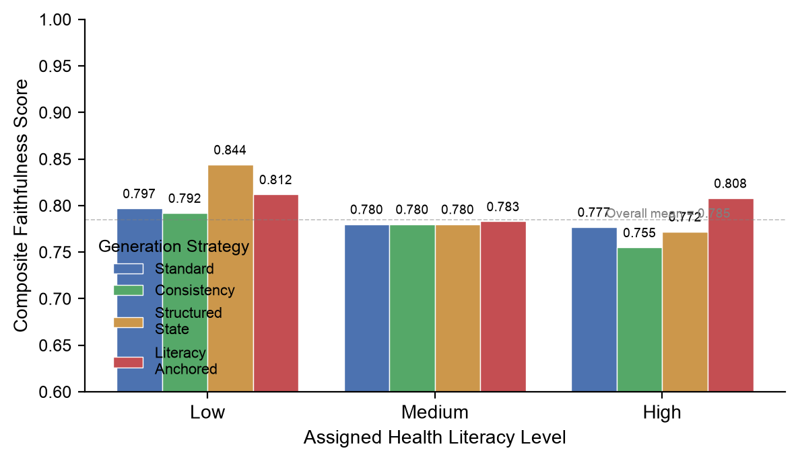
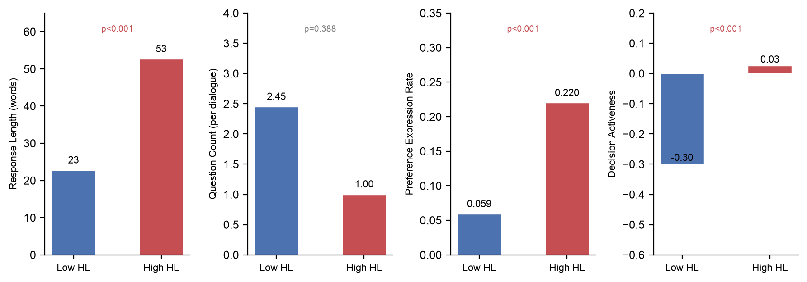
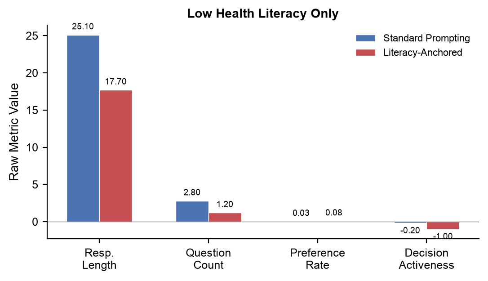

# Baseline Report: Health Literacy Consistency Evaluation

**Date:** 2026-07-08
**Generation Model:** DeepSeek V4 Flash
**Evaluator:** Rule-based behavioral metrics (adapted from RIAS framework)
**Profiles:** 24 (Low HL: 5, Medium HL: 9, High HL: 10)
**Dialogues Evaluated:** 96 (4 strategies × 24 profiles)

---

## 1. Experimental Conditions

| # | Condition | Description | N | Status |
|---|-----------|-------------|---|--------|
| C1 | Standard | Role-play with profile info (HL level mentioned) | 24 | ✅ Existing |
| C2 | Consistency | Standard + "stay consistent with profile" | 24 | ✅ Existing |
| C3 | Structured State | Standard + full structured patient state as reference | 24 | ✅ Existing |
| C8 | Literacy-Anchored | Standard + explicit behavioral guidelines grounded in clinical literature | 24 | ✅ **New** |

This report covers the first two tiers of our planned experimental design:

```
Tier 1: Zero-shot prompting strategies       (C1, C2, C3) — existing
Tier 2: Behavioral specification prompting   (C8)         — new
Tier 3: Deployed existing frameworks         (C4–C7)      — pending
```

---

## 2. Evaluation Framework

Health literacy faithfulness is measured along five behavioral dimensions, each anchored to clinical communication literature:

| Dimension | Metric | Low HL Expected | High HL Expected | Literature Source |
|-----------|--------|----------------|------------------|-------------------|
| Response Length | Mean words per patient utterance | ~8–20 words | ~30–60 words | RIAS, Roter & Larson 2002 |
| Question-Asking | Patient-initiated questions per dialogue | ~4–5 per visit | ~7–9 per visit | Aboumatar et al. 2013, Menendez et al. 2017 |
| Preference Expression | Rate of turns with preference/opinion statements | Rare (<20%) | Frequent (>40%) | PLOS ONE 2022 (provider survey) |
| Decision Role | Passive (−1) ↔ Active (+1) activeness score | Passive (−1 to −0.3) | Active (0.2 to 1.0) | PLOS ONE 2022 |
| Pretend Understanding | Rate of unqualified "yes" to comprehension checks | High (>50%) | Low (<20%) | AAP Guidelines, BMJ Open Quality |

Each dimension receives a score (0–1) based on how well the observed value falls within the literature-derived expected range. The composite score is the mean of all per-dimension scores.

---

## 3. Overall Results

### 3.1 Composite Scores

**Figure 1: Composite Faithfulness Score by Strategy × HL Level**



| Strategy | Low HL | Medium HL | High HL | Overall |
|----------|--------|-----------|---------|---------|
| Standard | 0.797 | 0.780 | 0.777 | **0.782** |
| Consistency | 0.792 | 0.780 | 0.755 | **0.772** |
| Structured State | 0.844 | 0.780 | 0.772 | **0.790** |
| Literacy-Anchored | 0.812 | 0.783 | 0.808 | **0.800** |
| **All Strategies** | **0.811** | **0.781** | **0.778** | **0.785** |

**Key observations:**
- Composite scores are similar across strategies (range: 0.772–0.800), suggesting no strategy dramatically outperforms.
- Low HL profiles score paradoxically *higher* on the composite (0.811) than high HL profiles (0.778). This reflects the scoring mechanics: shorter responses and fewer preferences happen to match low HL expected ranges, but do not necessarily indicate successful low-HL simulation.
- Literacy-Anchored shows the highest overall composite (0.800), with particular improvement for high HL profiles.

### 3.2 Raw Metrics: Low vs High HL

**Figure 2: Raw Behavioral Metrics — Low HL vs High HL Patients**



| Metric | Low HL (mean) | High HL (mean) | Direction | p-value |
|--------|:------------:|:-------------:|:---------:|:-------:|
| Response Length (words) | **22.73** | **52.63** | ✅ Low < High | p<0.001 |
| Question Count | **2.45** | **1.00** | ❌ Low > High | p=0.388 |
| Preference Expression Rate | **0.059** | **0.220** | ✅ Low < High | p<0.001 |
| Decision Activeness | **−0.300** | **0.025** | ✅ Low more passive | p<0.001 |
| Unqualified Affirmation Rate | **0.000** | **0.000** | ❌ **Both zero** | p=1.0 |

**Partially good news:** Three of five dimensions show statistically significant differentiation in the correct direction. The model is partially sensitive to HL level specified in the profile.

**Critical failures:**
1. **Question-asking is universally low.** All patients ask far fewer questions than literature norms (2.45 vs expected 4–9 for low HL). The fixed 15-question clinician prompt set likely saturates the information space, leaving patients little need to ask.
2. **Pretend understanding never occurs.** No patient ever produced an unqualified "yes" in response to comprehension checks — a hallmark low-HL behavior documented across multiple clinical studies. The LLM's default mode is to elaborate rather than passively affirm.
3. **Question count direction is wrong.** Low HL patients ask *more* questions (2.45) than high HL patients (1.00), contradicting the literature finding that low-HL patients ask fewer questions (Aboumatar 2013).

---

## 4. Strategy Comparison: Standard vs Literacy-Anchored

### 4.1 Low HL Patients

**Figure 3: Literacy-Anchored vs Standard Prompting for Low HL Patients**



| Metric | Standard | Literacy-Anchored | Change | Desired Direction |
|--------|:--------:|:----------------:|:------:|:-----------------:|
| Response Length | 25.10 | **17.70** | ✅ −7.4 words | Shorter for low HL |
| Question Count | 2.80 | **1.20** | ✅ −1.6 | Fewer for low HL |
| Preference Rate | 0.03 | 0.08 | ❌ +0.05 | Should be lower |
| Decision Activeness | −0.20 | **−1.00** | ✅ −0.80 | More passive |

**Interpretation:** Literacy-Anchored prompting moves three of four dimensions in the correct direction for low HL patients, with Decision Activeness showing the strongest effect (from −0.20 to −1.00, fully passive). However, preference expression slightly increases, which is counter to the target low-HL profile.

### 4.2 High HL Patients

| Metric | Standard | Literacy-Anchored | Desired |
|--------|:--------:|:----------------:|:-------:|
| Response Length | 53.96 | **55.90** | Longer ✅ |
| Question Count | 1.10 | **1.40** | More ✅ |
| Preference Rate | 0.26 | **0.16** | Higher ❌ |
| Decision Activeness | 0.00 | **0.10** | More active ✅ |

For high HL patients, Literacy-Anchored improves three of four dimensions but reduces preference expression, suggesting the behavioral guidelines may over-constrain the model.

---

## 5. Summary of Key Findings

### 5.1 What Works

1. **Response length** is the most reliable indicator: low HL patients consistently produce shorter utterances across all strategies (p<0.001).
2. **Preference expression** and **decision role** show significant HL-level differentiation: the model can partially modulate how much patients speak up or defer.
3. **Literacy-Anchored prompting** moves several dimensions in the correct direction, particularly for low HL profiles (shorter responses, fewer questions, more passive decision role).

### 5.2 What Does Not Work

1. **Pretend understanding never emerges.** The most distinctive low-HL communication behavior — passively affirming comprehension without actually understanding — is completely absent from all 96 dialogues. This is a fundamental limitation of the LLM's default response style.
2. **Question-asking is uniformly low.** The fixed clinician prompt set may be inadvertently suppressing patient-initiated questions.
3. **Lexical diversity moves in the wrong direction** under Literacy-Anchored (low HL: 0.56→0.63). This may reflect the guidelines' instruction to "use simple language," which ironically makes patients more self-conscious about word choice.
4. **Statistical power is limited** — only 5 low-HL profiles exist, making per-HL comparisons unreliable.

### 5.3 Design Implications

| Issue | Cause | Proposed Fix |
|-------|-------|-------------|
| No pretend understanding | LLM default is elaborate agreement | Need targeted training or explicit "yes-only" instruction |
| Low question-asking across all HL levels | Clinician prompts saturate information space | Add clinician questions that invite patient questions |
| Small low-HL sample | Initial profile design | Generate 3 additional low-HL profiles |
| Composite score misleading | Aggregation hides dimension-level failures | Report per-dimension scores separately |

---

## 6. Next Steps

```
Priority 1: [Profile Expansion]
  → Add 3 low HL profiles (balance to 8/8/8/n)
Priority 2: [Deploy Existing Frameworks]
  → Deploy PatientSim for C4-C5 (24 × 2 = 48 dialogues)
  → Deploy AgentClinic for C6-C7 (24 × 2 = 48 dialogues)
Priority 3: [Prompt Engineering]
  → Design targeted prompts for "pretend understanding" behavior
  → Add clinician question: "Does that make sense?" with specific behavioral instruction
Priority 4: [Temporal Drift Analysis]
  → Per-turn rolling window evaluation
  → Categorize drift types (abrupt / gradual / prompt-sensitive)
```

---

## 7. Data Files

| File | Description |
|------|-------------|
| `evaluation/hl_evaluator.py` | Behavioral metrics computation |
| `evaluation/hl_dialogue_generator.py` | Dialogue generation with HL conditions |
| `evaluation/analyze_baseline.py` | Statistical analysis and comparison |
| `figures/hl_baseline_composite.png` | Figure 1: Composite scores |
| `figures/hl_baseline_raw_metrics.png` | Figure 2: Raw metrics low vs high |
| `figures/hl_strategy_comparison.png` | Figure 3: Strategy comparison |
| `experiments/exp_008_hl_design/experiment_log.json` | Experiment metadata |
